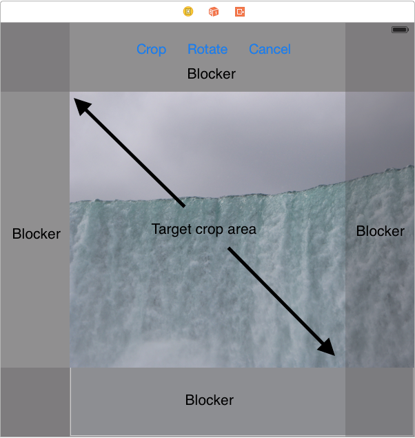
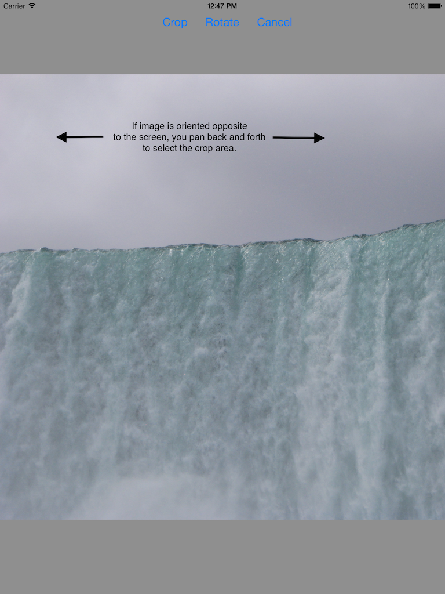

SquareCropViewController
========================

Simple view controller for cropping a UIImage to a square by panning the image under shaded cutoff areas.  Shows how to use autolayout to implement a complex task with very little code.  

Positioning the Crop Opening
----------------------------
The goal is to crop the image to the largest square which fits the aspect ratio of the device.  Shaded views ("blockers") appear over the areas to be cropped.  The image slides back and forth underneath the shaded views.  The user taps the "Crop" button to crop the image to the square area.

Autolayout "calculates" the size of the square crop area and positions the blockers automatically.  

There are five views involved: a hidden "Crop Opening" view; and four blockers (left, right, top, bottom).  The Crop Opening is positioned over the target crop area, and is constrained to be square (via an aspect constraint).  The blockers sit between the boundary of the superview and the Crop Opening, one on each side.  Each of the blockers is constrained to a boundary on one side, and the Crop Opening on the other -- the Crop Opening is sandwiched between the blockers and centered on the screen.

This set of constraints causes autolayout to size the Crop Opening to fit the smallest dimension of the superview, and center it within the largest dimension of the superview.  Along the large superview axis, the blockers expand to fill the space between the view boundaries and the Crop Opening;  along the small axis, they shrink to nothing and are not visible.

Panning the Image
-----------------
Underneath the Crop Opening and blockers, there is a UIScrollView.  The source image sits inside the scroll view, allowing the user to pan to select the area to crop.  

To perform the crop, all the view controller needs to do is calculate the position of the Crop Opening with respect to the image position within the scroll view -- all the tricky positioning and scaling is done automagically by autolayout!

Programmatic Actions
--------------------
Though autolayout does most of the work, there are a few things which can only be configured once the dimensions of the image are known.  The view controller handles these things by modifying constraints at runtime.  (Note that it *never* modifies the bounds/frame of views explicitly -- changing view dimensions manually conflicts with autolayout).

When the image is oriented orthogonally to the screen (i.e. the image is in portrait, screen in landscape or vice-versa), the view controller moves the scroll view so it sits between the blockers along the large screen axis.  This creates a channel in which the image can slide back and forth.  The Crop Opening is the area visible on the screen.

To enable autolayout to handle this function, the scroll view contains two sets of constraints:  one set on each side to the blockers, and another set to the boundaries of the superview.  The view controller positions the scroll view by enabling/disabling pairs of these constraints:  for example, to position the scroll view below the top blocker, it enables the blocker-to-scroll view constraint, and disables the scroll view-to-superview constraint.  To position the scroll view along the top edge of the superview, it would do the opposite.

The second group of things which need to be configured programmatically are the properties of the scroll view itself.  These also depend on the image dimensions.  The view controller configures the scroll view to display the image at the size which fits into the small dimension of the Crop Opening.  Then, it sets the scroll view's content insets to allow it to pan underneath the blockers.

Comments/questions/improvements?
--------------------------------
Feel free to [contact me](annabd@wackybananasoftware.com) with any feedback or questions!

***Anna Dickinson***
